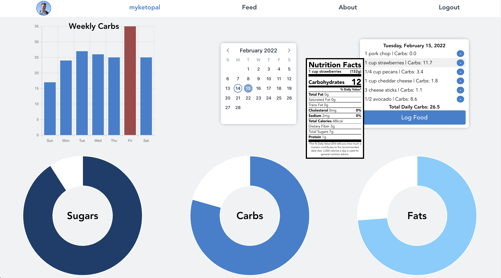
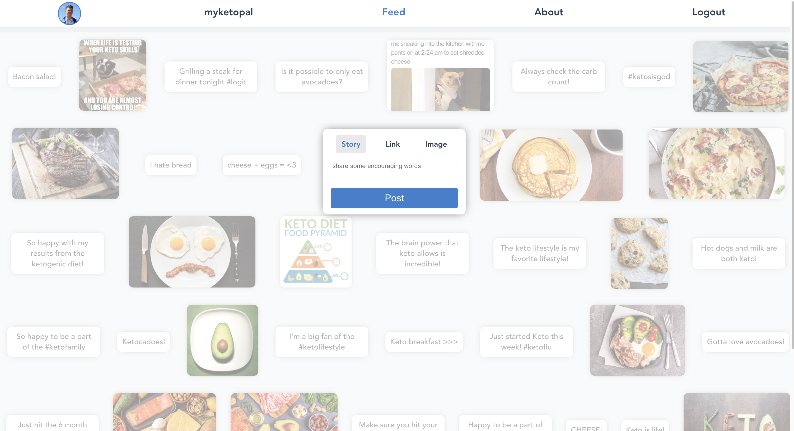

# **MyKetoPal Nutrient Tracker**

### Grant Menke

### 2/14/2022

#### [GitHub](https://github.com/gmenke54) | [LinkedIn](https://www.linkedin.com/in/grant-menke-b81490223/)

---

A Full-stack proprietary nutrient tracker to help users become informed on and maintain a ketogenic diet.

---

## **_Description_**

This is a full CRUD browser-based ketogenic-diet centered nutrient tracking app written in Vue.js, Django, and Python which I coded two weeks after being introduced to these languages.

**Backend Github:** [Github](https://github.com/gmenke54/My_Keto_Pal)
**Frontend Github:** [Github](https://github.com/gmenke54/My_Keto_Pal_Front_End)

---

## **_Screenshots_**

Final Application Screenshots:

---

## **_Technologies_**

- Vue.js
- Vuex
- Python
- Django
- Javascript

---

## **_Roadmap (Future Updates)_**

- ~~Integrate Nutrient Tracker~~
- Integrate live ketogenic diet scholarly articles into feed page
- Implement a live chat box using websockets
- Allow users to upload progress photos
- Include vitamins in database for food and recipes

---

## **_Getting Started_**

#### [Deployed on Heroku](myketopal.surge.sh/)

The Entity Relationship Diagram and Component Hierarchy Diagram I used to develop this application can be found on the project's **[Trello Board](https://trello.com/b/9IyxbjNg/keto-build)**

1. Sign-up for an account
2. Log-in with your credentials
3. Create a profile to customize your expierence
4. Log the food you eat each day on the dashboard
5. Share links, images, and words of encouragement on the feed page
6. Track your progress and view your custom projection on your profile

---

## **_Credits_**

**Keto Food Title Image:** [Unsplashed, Brooke Lark](https://unsplash.com/photos/jUPOXXRNdcA)

**Logo Designed Using:** [Canva](https://www.canva.com/)

**Nutrients API:** [EDAMAM](https://developer.edamam.com/edamam-docs-nutrition-api)

**Token Based Auhentication Tutorial** [MonkHaus](https://www.youtube.com/watch?v=LXV4wn8scvM&t=2884s)

**Date Picker Plugin:** [V-Calendar](https://vcalendar.io/)

**URL Link Preview API:** [Link Preview](https://www.linkpreview.net/)

**Loading Wheel CSS:** [Loading.io](https://loading.io/css/)

**Data Mapping Plugin:** [Chart.js, Vue-Chart-3](https://vue-chart-3.netlify.app/)

**Toggle Button Plugin:** [VueForm](https://github.com/vueform/toggle)
